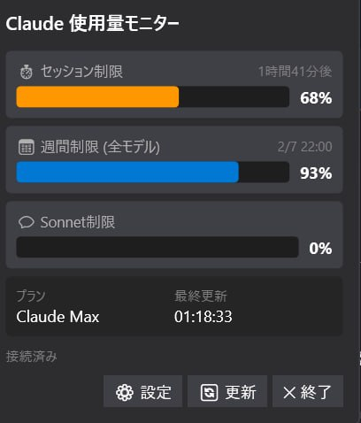

# Claude Usage Monitor

<p align="center">
  
</p>

Windows タスクバーで Claude.ai の使用状況をリアルタイム監視するアプリ。

## ✨ 機能

- 🔐 **WebView2 ベースの認証** - Cloudflare バイパス対応
- 📊 **3種類のリミット表示**
  - 5時間セッション制限
  - 7日間ウィークリー制限
  - Sonnet モデル専用制限
- 🔄 **バックグラウンド自動更新** - 1/2/5/10分間隔で設定可能
- 💾 **キャッシュ機能** - 即座に起動時表示
- 📋 **プラン自動検出** - Pro / Max を自動判別
- 🇯🇵 **日本語UI**

## 📥 インストール

### 必要要件
- Windows 10/11 (x64)
- Microsoft Edge WebView2 Runtime（通常はプリインストール済み）
- Claude Pro または Claude Max サブスクリプション

### ダウンロード
[Releases](https://github.com/mhit/claude-usage-monitor/releases) から最新版の `ClaudeUsageMonitor-vX.X.X-win-x64.zip` をダウンロード

### セットアップ
1. ZIPを任意のフォルダに解凍
2. `ClaudeUsageMonitor.exe` を実行
3. システムトレイにアイコンが表示される
4. 初回起動時にログインウィンドウが開くので、claude.aiにログイン
5. ログイン完了後、自動的に使用状況が表示される

## 🖱️ 使い方

| 操作 | 動作 |
|------|------|
| トレイアイコン左クリック | ポップアップ表示 |
| トレイアイコン右クリック | メニュー表示 |
| 今すぐ更新 | 使用状況を即時取得 |
| 設定 | 更新間隔の変更 |
| 終了 | アプリを終了 |

## 🔧 設定

設定は以下の場所に保存されます：
- 設定ファイル: `%LOCALAPPDATA%\ClaudeUsageMonitor\settings.json`
- キャッシュ: `%LOCALAPPDATA%\ClaudeUsageMonitor\usage_cache.json`
- ログ: `%LOCALAPPDATA%\ClaudeUsageMonitor\debug.log`

## 🛠️ 技術スタック

- C# / .NET 8.0
- WPF (Windows Presentation Foundation)
- WebView2 (Microsoft Edge)
- CommunityToolkit.Mvvm
- Hardcodet.NotifyIcon.Wpf

## 📝 開発

### ビルド
```bash
# WSL2 Ubuntu でのクロスコンパイル
~/.dotnet/dotnet publish -c Release -r win-x64 --self-contained true -p:EnableWindowsTargeting=true -o /mnt/c/Users/mhit/ClaudeUsageMonitor
```

### プロジェクト構成
```
src/ClaudeUsageMonitor/
├── Models/          # データモデル
├── Services/        # APIクライアント、ポーリングサービス
├── ViewModels/      # MVVM ViewModel
├── Views/           # XAML UI
└── Helpers/         # コンバーター等
```

## ⚠️ 注意事項

- このアプリは非公式です。Anthropic とは無関係です。
- Claude.ai の API 仕様変更により動作しなくなる可能性があります。
- 認証情報はローカルの WebView2 キャッシュに保存されます。

## 📄 ライセンス

MIT License

## 🔗 関連リンク

- [Claude.ai](https://claude.ai/)
- [Anthropic](https://www.anthropic.com/)
